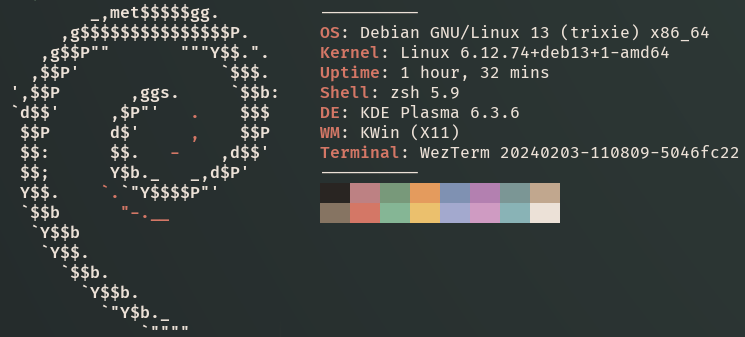

# A "Melangely" Theme for WezTerm


A faithful interpretation of the Melange Color Scheme for Wezterm. Since it changes default Shell colors, implicitly also themes zsh / tmux etc.

Inspired by [Melangely Tmux](https://github.com/OwlfaceGames/melangey_tmux), in turn inspired by the original [Melange Theme](https://github.com/savq/melange-nvim) for neovim.

I tried to make this as "melangely" as possible, hence the name. I personally prefer a modified version, thus this is the "faithful" version.

# Install
```
git clone https://github.com/LumenLuminis/Melangely-Faithful-Wezterm /tmp/Melangely-Faithful-Wezterm
mkdir -p ~/.config/wezterm/colors/
cp /tmp/Melangely-Faithful-Wezterm/Melangely-Faithful.toml ~/.config/wezterm/colors/
```
Then, in your `.wezterm.lua` config file set
```
color_scheme = "Melangely-Faithful",
```
